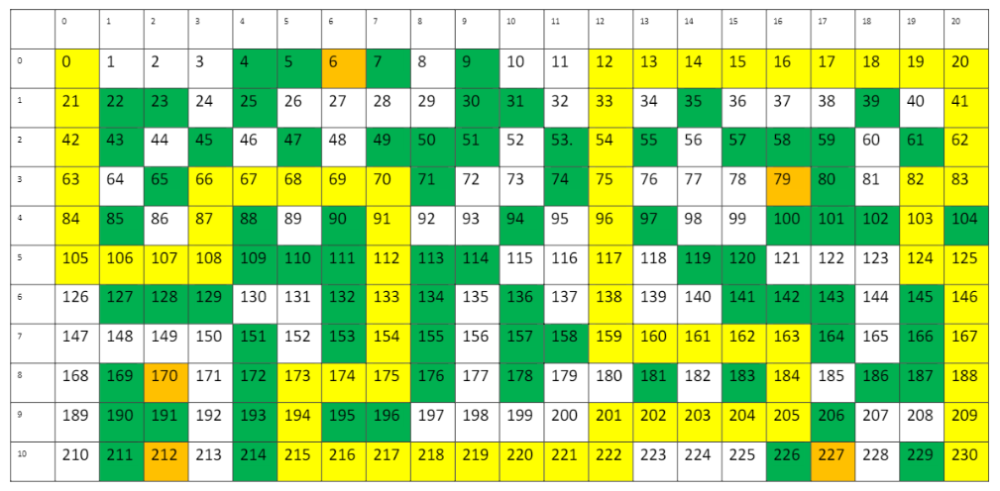
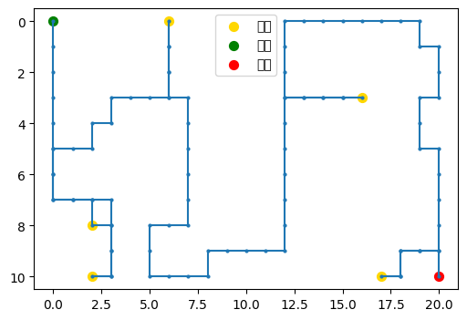

# 使用 Q-Learning 逃離迷宮

本專案實作一個 Q-learning 解決方案，讓智能體在收集寶藏的同時逃離迷宮。智能體必須學會從起點導航到終點，同時最大化寶藏收集數量並最小化所需步數。

## 問題描述

- **迷宮大小**: 21 x 11 網格
- **起點位置**: 左上角 (0,0)
- **終點位置**: 右下角 (20,10)
- **最大訓練回合**: 1000
- **目標**: 以最少步數到達終點並收集寶藏

### 迷宮地圖

原始迷宮地圖（ori_maze.png）:


### 路徑視覺化與解答

訓練完成後的路徑結果（answer.png）:


智能體最終路徑展示:
- 藍色線條和點: 智能體的完整移動路徑
- 黃色點: 寶藏位置
- 綠色點: 起點位置
- 紅色點: 終點位置

最終訓練結果:
```
Ep 1000 | ε=0.100 | best_steps=100 | best_score=5
=== 最終結果 （成功） ===
停止原因：reached goal with all treasures
步數：100
寶藏：5/5 -> [(2, 10), (2, 8), (6, 0), (16, 3), (17, 10)]
最終停留：(20, 10) (應為 (20, 10))
```

## 使用方式

執行 Jupyter notebook `qtable.ipynb` 來訓練智能體並視覺化結果。訓練好的 Q-table 會同時儲存為 `.npz` 和 `.pt` 格式以供未來使用。

## 實作細節

### 核心演算法：Double Q-Learning
使用雙 Q-learning 來減少 Q-learning 中的過度估計問題：
- 維護兩個 Q-table (Q1 和 Q2)
- 隨機選擇其中一個來更新
- 使用另一個來估計下一個狀態的最大 Q 值
- 降低估計偏差，提高學習穩定性

### 獎勵機制設計
1. **基礎獎勵**
   - 每步基礎懲罰: -1 (鼓勵更短的路徑)
   - 撞牆懲罰: -500 (避免無效移動)
   - 到達終點獎勵: 
     - 收集所有寶藏: +100
     - 未收集所有寶藏: -80

2. **寶藏獎勵**
   - 基礎獎勵: 10 分
   - 動態加成: +2 * 當前分數
   - 例如：第一個寶藏 10分，第二個 12分，依此類推
   - 每個寶藏只能獲得一次獎勵

3. **移動優化獎勵**
   - 振盪懲罰: -40 (防止在相同位置來回移動)
   - 回頭懲罰: -30 (避免立即反向移動)
   - 重複訪問懲罰: 訪問次數超過2次時，每次 -12 * (訪問次數-1)

4. **探索獎勵**
   - 基於訪問次數的獎勵: 1.0 / sqrt(訪問次數)
   - 鼓勵探索未訪問的區域
   - 隨著訪問次數增加而遞減

### 探索策略
1. **動態 Epsilon-Greedy**
```python
if ep < 100:
    epsilon = max(0.2, epsilon * 0.995)
elif ep < 300:
    epsilon = max(0.05, epsilon * 0.998)
else:
    epsilon = 0.01
```
- 初期較高探索率
- 中期緩慢下降
- 後期保持小量探索

### 經驗回放機制
使用 Prioritized Sweeping 進行經驗回放：
1. 維護優先級隊列
2. 根據 TD 誤差大小決定優先級
3. 每步更新後進行多次回放
4. 動態調整回放次數：
   - 前 150 回合：10 次
   - 之後回合：20 次

### 狀態表示
使用複合狀態編碼：
```python
def encode_state(pos, mask):
    return to_index(pos) * NUM_MASK + mask
```
- 位置信息：當前座標 (x,y)
- 寶藏掩碼：已收集寶藏的二進制表示
- 總狀態數：WIDTH * HEIGHT * 2^(寶藏數量)

### 潛在函數獎勵塑形
使用曼哈頓距離作為潛在函數：
```python
def potential(pos, mask):
    remaining = [treasure_list[i] 
                for i in range(len(treasure_list)) 
                if not (mask & (1<<i))]
    if not remaining:
        remaining = [GOAL]
    return -min(manhattan(pos, tgt) for tgt in remaining)
```
- 計算到最近未收集寶藏的距離
- 如果所有寶藏都收集完，則考慮到終點的距離
- 使用 BETA 參數(0.7)控制潛在函數的影響力

### 記憶機制
1. **短期記憶**
   - 使用 deque 記錄最近 5 步
   - 用於檢測振盪行為
   - 收集寶藏時重置，允許必要的折返

2. **長期記憶**
   - 記錄所有位置的訪問次數
   - 用於計算新奇獎勵
   - 影響探索策略

[rest of the content remains the same...]